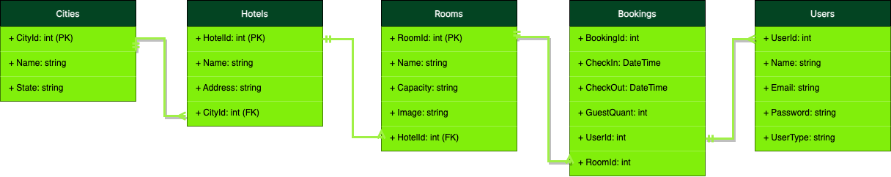

# Projeto TrybeHotel

Penúltimo projeto de C# fornecido para prática de todas as tecnologias até então estudadas no momento pela instituição Trybe. Neste projeto criamos um CRUD com tudo que aprendemos em C#!

## Diagrama Entidade Relacionamento do projeto


## Aprendizados

Neste projeto tive o prazer de aplicar os temas sobre a programação orientada a objetos e os princípios SOLID em uma API RestFul.

## Stack utilizada

**C#:** Azure, JWT, SOLID, Entitity Framework, C#.NET, Docker.


## Instalação

Instalação com NPM

```bash
  git clone git@github.com:tryber/csharp-031-csharp-projeto-trybe-hotel-fase-d.git
  cd cd csharp-031-csharp-projeto-trybe-hotel-fase-d/ cd src
  donet restore
  docker compose up -d --build para subir o container
```
    
## Autores

- [@Natan Santana (Aero)](https://github.com/Natandso)


## Licença e Autoria

Arquivos como .trybe e trybe.yml

[Trybe](https://www.betrybe.com/)


# Sobre os Requisitos do Projeto
Controllers/: Este diretório armazena os arquivos com as lógicas dos controllers da aplicação. Os métodos a serem desenvolvidos estão prontos mas sem implementação alguma, o que você desenvolverá ao longo do projeto.

Models/: Este diretório armazena os arquivos com as models do banco de dados. As models City, Hotel e Room serão as instruções para as tabelas Cities, Hotels e Rooms. Lembre-se, o nome da tabela não é dado pelo nome da model mas sim pelo nome do DBSet<model> presente no contexto.

DTO/: Este diretório armazena as classes de DTO. Algumas rotas esperam as responses baseadas nestes DTOs. Você pode conferir isso pelo requisito do projeto e pelo retorno dos métodos dos repositories.

Repository/: Este diretório armazena as lógicas que farão a interação com o banco de dados. Os métodos de cada requisito já estão criados e você deverá incluir a implementação de cada um desses métodos respeitando o retorno do DTO. Além disso, você terá o arquivo TrybeHotelContext com o contexto para a conexão com o banco de dados. Todos os repository e o context possuem interfaces que estão nesse diretório e fornecem o contrato para essas classes.


## Database Utilizado
  - [Nessa seção](#Azure) temos o diagrama de entidades;

<details>
  <summary><strong> Requisitos </strong></summary>

### 1. Implemente as models da aplicação
Mais informações:
Implemente os arquivos do diretório /src/TrybeHotel/Models/

Implemente a model City
Implemente a model Hotel
Implemente a model Room
Implemente o contexto do banco de dados

O que será testado:

Será testado que todas as models foram implementadas corretamente.
Será testado que as models possuem as chaves primárias e estrangeiras necessárias.

### 2. Desenvolva o endpoint GET /city
Mais informações:
Este endpoint será responsável por listar todas as cidades.
Implemente a lógica da sua controller no método GetCities() do arquivo src/TrybeHotel/Controllers/CityController.cs.
Implemente a lógica de interação ao banco de dados no método GetCities() do arquivo src/TrybeHotel/Repository/CityRepository.cs.
A sua repository retorna um tipo CityDto que deverá ser implementado no arquivo src/TrybeHotel/Dto/CityDto.cs. A sua classe de DTO deve seguir o formato da response da requisição.

👀 De olho na dica: Monte o retorno do seu repository com os conhecimentos de LINQ e DTO já obtidos.

👀 De olho na dica 2: Para converter qualquer tipo de coleção no tipo de coleção List, utilize o método ToList().


O endpoint deve ser acessível através da URL /city e deve ser do tipo GET;
O corpo da requisição é vazio.
A resposta deve ser o status 200.
O corpo da resposta deve seguir o formato abaixo:

```json
[
    {
	    "cityId": 1,
	    "name": "Rio Branco"
    },

  /*...*/
]
O que será testado:

<UL>
Será testado que, quando solicitada a requisição, a mesma informe os dados correspondentes do banco de dados.
Será testado que o status de retorno será 200.
Será testado que o corpo da resposta segue o padrão esperado.
</UL>

### 3. Desenvolva o endpoint POST /city
Mais informações:
Este endpoint será responsável por inserir uma nova cidade.
Implemente a lógica da sua controller no método PostCity() do arquivo src/TrybeHotel/Controllers/CityController.cs.
Implemente a lógica de interação ao banco de dados no método AddCity() do arquivo src/TrybeHotel/Repository/CityRepository.cs.
A sua repository retorna um tipo CityDto que deverá ser implementado no arquivo src/TrybeHotel/Dto/CityDto.cs. A sua classe de DTO deve seguir o formato da response da requisição.

👀 De olho na dica: Monte o retorno do seu repository com os conhecimentos de LINQ e DTO já obtidos.

👀 De olho na dica 2: Para obter um único elemento de uma coleção, você pode obter o primeiro com o método First(). Exemplo: coleção.First().


O endpoint deve ser acessível através da URL /city e deve ser do tipo POST;
O corpo da requisição deve seguir o padrão abaixo
{
	"Name": "Rio de Janeiro"
}
A resposta deve ser o status 201.
O corpo da resposta deve seguir o formato abaixo:
{
	  "cityId": 2,
	  "name": "Rio de Janeiro"
},
O que será testado:

Será testado que, quando solicitada a requisição, a mesma insira no banco de dados e retorne de acordo com o modelo
Será testado que o status de retorno será 201.
Será testado que o corpo da resposta segue o padrão esperado.

### 4. Desenvolva o endpoint GET /hotel
Mais informações:
Este endpoint será responsável por listar todos os hotéis.
Implemente a lógica da sua controller no método GetHotels() do arquivo src/TrybeHotel/Controllers/HotelController.cs.
Implemente a lógica de interação ao banco de dados no método GetHotels() do arquivo src/TrybeHotel/Repository/HotelRepository.cs.
A sua repository retorna um tipo HotelDto que deverá ser implementado no arquivo src/TrybeHotel/Dto/HotelDto.cs. A sua classe de DTO deve seguir o formato da response da requisição.

👀 De olho na dica: Monte o retorno do seu repository com os conhecimentos de LINQ e DTO já obtidos.

👀 De olho na dica 2: Para converter qualquer tipo de coleção no tipo de coleção List, utilize o método ToList().


O endpoint deve ser acessível através da URL /hotel e deve ser do tipo GET;
O corpo da requisição é vazio.
A resposta deve ser o status 200.
O corpo da resposta deve seguir o formato abaixo:
[
    {
		  "hotelId": 1,
		  "name": "Trybe Hotel SP",
		  "address": "Avenida Paulista, 1400",
		  "cityId": 1,
		  "cityName": "São Paulo"
	  },

  /*...*/
]
O que será testado:

Será testado que, quando solicitada a requisição, a mesma informe os dados correspondentes do banco de dados.
Será testado que o status de retorno será 200.
Será testado que o corpo da resposta segue o padrão esperado.

### 5. Desenvolva o endpoint POST /hotel
Mais informações:
Este endpoint será responsável por inserir um novo hotel.
Implemente a lógica da sua controller no método PostHotel() do arquivo src/TrybeHotel/Controllers/HotelController.cs.
Implemente a lógica de interação ao banco de dados no método AddHotel() do arquivo src/TrybeHotel/Repository/HotelRepository.cs.
A sua repository retorna um tipo HotelDto que deverá ser implementado no arquivo src/TrybeHotel/Dto/HotelDto.cs. A sua classe de DTO deve seguir o formato da response da requisição.

👀 De olho na dica: Monte o retorno do seu repository com os conhecimentos de LINQ e DTO já obtidos.

👀 De olho na dica 2: Para obter um único elemento de uma coleção, você pode obter o primeiro com o método First(). Exemplo: coleção.First().


O endpoint deve ser acessível através da URL /hotel e deve ser do tipo POST;
O corpo da requisição deve seguir o padrão abaixo
{
	"Name":"Trybe Hotel RJ",
	"Address":"Avenida Atlântica, 1400",
	"CityId": 2
}
A resposta deve ser o status 201.
O corpo da resposta deve seguir o formato abaixo:
{
	"hotelId": 2,
	"name": "Trybe Hotel RJ",
	"address": "Avenida Atlântica, 1400",
	"cityId": 2,
	"cityName": "Rio de Janeiro"
}
O que será testado:

Será testado que, quando solicitada a requisição, a mesma insira no banco de dados e retorne de acordo com o modelo
Será testado que o status de retorno será 201.
Será testado que o corpo da resposta segue o padrão esperado.

### 6. Desenvolva o endpoint GET /room/:hotelId
Mais informações:
Este endpoint será responsável por listar todos os quartos de um determinado hotel
Implemente a lógica da sua controller no método GetRoom() do arquivo src/TrybeHotel/Controllers/RoomController.cs.
Implemente a lógica de interação ao banco de dados no método GetRooms() do arquivo src/TrybeHotel/Repository/RoomRepository.cs.
A sua repository retorna um tipo RoomDto que deverá ser implementado no arquivo src/TrybeHotel/Dto/RoomDto.cs. A sua classe de DTO deve seguir o formato da response da requisição.

👀 De olho na dica: Monte o retorno do seu repository com os conhecimentos de LINQ e DTO já obtidos.

👀 De olho na dica 2: Para converter qualquer tipo de coleção no tipo de coleção List, utilize o método ToList().


O endpoint deve ser acessível através da URL /room/:hotelId e deve ser do tipo GET;
O corpo da requisição é vazio.
A resposta deve ser o status 200.
O corpo da resposta deve seguir o formato abaixo:
[
    {
		  "roomId": 1,
		  "name": "Suite básica",
		  "capacity": 2,
		  "image": "image suite",
		  "hotel": {
  			"hotelId": 1,
			  "name": "Trybe Hotel SP",
			  "address": "Avenida Paulista, 1400",
			  "cityId": 1,
			  "cityName": "São Paulo"
		  }
	  },

  /*...*/
]
O que será testado:

Será testado que, quando solicitada a requisição, a mesma informe os dados correspondentes do banco de dados.
Será testado que o status de retorno será 200.
Será testado que o corpo da resposta segue o padrão esperado.

### 7. Desenvolva o endpoint POST /room
Mais informações:
Este endpoint será responsável por inserir um novo quarto a um hotel.
Implemente a lógica da sua controller no método PostRoom() do arquivo src/TrybeHotel/Controllers/RoomController.cs.
Implemente a lógica de interação ao banco de dados no método AddRoom() do arquivo src/TrybeHotel/Repository/RoomRepository.cs.
A sua repository retorna um tipo RoomDto que deverá ser implementado no arquivo src/TrybeHotel/Dto/RoomDto.cs. A sua classe de DTO deve seguir o formato da response da requisição.

👀 De olho na dica: Monte o retorno do seu repository com os conhecimentos de LINQ e DTO já obtidos.

👀 De olho na dica 2: Para obter um único elemento de uma coleção, você pode obter o primeiro com o método First(). Exemplo: coleção.First().


O endpoint deve ser acessível através da URL /room e deve ser do tipo POST;
O corpo da requisição deve seguir o padrão abaixo
{
	"Name":"Suite básica",
	"Capacity":2,
	"Image":"image suite",
	"HotelId": 1
}
A resposta deve ser o status 201.
O corpo da resposta deve seguir o formato abaixo:
{
	"roomId": 1,
	"name": "Suite básica",
	"capacity": 2,
	"image": "image suite",
	"hotel": {
		"hotelId": 1,
		"name": "Trybe Hotel SP",
		"address": "Avenida Paulista, 1400",
		"cityId": 1,
		"cityName": "São Paulo"
	}
}
O que será testado:

Será testado que, quando solicitada a requisição, a mesma insira no banco de dados e retorne de acordo com o modelo
Será testado que o status de retorno será 201.
Será testado que o corpo da resposta segue o padrão esperado.

### 8. Desenvolva o endpoint DELETE /room/:roomId
Mais informações:
Este endpoint será responsável por deletar um determinado quarto.
Implemente a lógica da sua controller no método Delete() do arquivo src/TrybeHotel/Controllers/RoomController.cs.
Implemente a lógica de interação ao banco de dados no método DeleteRoom() do arquivo src/TrybeHotel/Repository/RoomRepository.cs.
O endpoint deve ser acessível através da URL /room/:roomId e deve ser do tipo DELETE;
O corpo da requisição é vazio.
A resposta deve ser o status 204.
O que será testado:

Será testado que, quando solicitada a requisição, a mesma faça a exclusão solicitada no banco de dados.
Será testado que o status de retorno será 204.


### 9. Implemente as models da aplicação
Mais informações:
Implemente os arquivos do diretório /src/TrybeHotel/Models/

Implemente as models do projeto anterior
Implemente a model User
Implemente a model Booking
Implemente o contexto do banco de dados

O que será testado:

Será testado que todas as models foram implementadas corretamente.
Será testado que as models possuem as chaves primárias e estrangeiras necessárias.

### 10. Desenvolva o endpoint POST /user
Mais informações:
Este endpoint será responsável por inserir uma nova pessoa usuária.
Implemente a lógica da sua controller no método Add() do arquivo src/TrybeHotel/Controllers/UserController.cs.
Implemente a lógica de interação ao banco de dados no método Add() do arquivo src/TrybeHotel/Repository/UserRepository.cs.
A sua repository retorna um tipo UserDto que deverá ser implementado no arquivo src/TrybeHotel/Dto/UserDto.cs. A sua classe de DTO deve seguir o formato da response da requisição.
O corpo da sua requisição deve seguir o tipo UserDtoInsert que deverá ser implementado no arquivo src/TrybeHotel/Dto/UserDto.cs. A sua classe de DTO deve seguir o formato da request da requisição.

👀 De olho na dica: Monte o retorno do seu repository com os conhecimentos de LINQ e DTO já obtidos.

👀 De olho na dica 2: Para obter um único elemento de uma coleção, você pode obter o primeiro com o método First(). Exemplo: coleção.First().


O endpoint deve ser acessível através da URL /user e deve ser do tipo POST;
O atributo userType deve ser salvo com o valor client.
O corpo da requisição deve seguir o padrão abaixo
{
	"Name":"Rebeca",
	"Email": "rebeca.santos@trybehotel.com",
	"Password": "123456"
}
Será testado que não é possível inserir uma pessoa usuária com e-mail repetido
Será testado que é possível inserir uma pessoa usuária com sucesso
⚠️ A partir da criação deste endpoint, você poderá utilizar o cadastro de pessoas usuárias. O sistema automaticamente cadastrará uma pessoa usuária admin com o e-mail admin@admin.com e senha admin. Você também pode alterar qualquer pessoa usuária para admin realizando um update no banco de dados com o comando SQL:

UPDATE Users SET UserType = 'admin' where UserId = 1
Substitua o número 1 pelo id da pessoa usuária que você deseja adicionar permissão de admin.

### 11. Desenvolva o endpoint POST /login
Mais informações:
Este endpoint será responsável por fazer um login.
Implemente a lógica da sua controller no método Login() do arquivo src/TrybeHotel/Controllers/LoginController.cs.
Implemente a lógica de interação ao banco de dados no método lOGIN() do arquivo src/TrybeHotel/Repository/UserRepository.cs.
A sua repository retorna um tipo UserDto que deverá ser implementado no arquivo src/TrybeHotel/Dto/UserDto.cs. A sua classe de DTO deve seguir o formato da response da requisição.
O corpo da sua requisição deve seguir o tipo LoginDto que deverá ser implementado no arquivo src/TrybeHotel/Dto/UserDto.cs. A sua classe de DTO deve seguir o formato da request da requisição.
A lógica para criar o token pode ser implementada nos métodos Generate e AddClaims no arquivo src/TrybeHotel/Services/TokenGenerator.cs.
Adicione em suas claims, uma claim com o tipo ClaimType.Email e o valor do e-mail da pessoa usuária.
Caso a pessoa usuária seja do tipo admin, adicione em suas claims, uma claim com o tipo ClaimType.Role e o valor admin.

👀 De olho na dica: Monte o retorno do seu repository com os conhecimentos de LINQ e DTO já obtidos.

👀 De olho na dica 2: Para obter um único elemento de uma coleção, você pode obter o primeiro com o método First(). Exemplo: coleção.First().


O endpoint deve ser acessível através da URL /login e deve ser do tipo POST;
O corpo da requisição deve seguir o padrão abaixo
{
	"Email": "rebeca.santos@trybehotel.com",
	"Password": "123456"
}
Será testado que não é possível fazer login com credenciais erradas
Será testado que é possível fazer login com sucesso


### 12. Adicione a autorização de admin no endpoint /POST hotel
Mais informações:
Este endpoint já foi desenvolvido na fase anterior. Agora iremos apenas adicionar uma permissão de admin.
Você pode copiar todas as controllers do projeto anterior.

Siga as instruções da seção Continuando o projeto Trybe hotel

Crie uma política chamada Admin que requira a claim ClaimType.Email e a claim ClaimType.Role como admin.
Crie uma política chamada Client que requira a claim ClaimType.Email.
As políticas devem ser criadas no arquivo src/TrybeHotel/Program.cs.
A adição da autorização da política no controller deve ser feita no arquivo src/TrybeHotel/Controllers/HotelController.cs.
O que será testado:

Será validado que é possível realizar as operações do endpoint com a autorização de admin.
Será validado que o status será proibido caso o acesso não seja admin.
Será validado que o status será não autorizado caso o acesso não exista.

### 13. Adicione a autorização de admin no endpoint /POST room
Mais informações:
Este endpoint já foi desenvolvido na fase anterior. Agora iremos apenas adicionar uma permissão de admin.
Você pode copiar todas as controllers do projeto anterior.

Siga as instruções da seção Continuando o projeto Trybe hotel

Crie uma política chamada Admin que requira a claim ClaimType.Email e a claim ClaimType.Role como admin. Este é o mesmo desenvolvimento do requisito anterior. Caso já tenha feito, pule esta parte.
Crie uma política chamada Client que requira a claim ClaimType.Email. Este é o mesmo desenvolvimento do requisito anterior. Caso já tenha feito, pule esta parte.
As políticas devem ser criadas no arquivo src/TrybeHotel/Program.cs. Este é o mesmo desenvolvimento do requisito anterior. Caso já tenha feito, pule esta parte.
A adição da autorização da política no controller deve ser feita no arquivo src/TrybeHotel/Controllers/RoomController.cs.
O que será testado:

Será validado que é possível realizar as operações do endpoint com a autorização de admin.
Será validado que o status será proibido caso o acesso não seja admin.
Será validado que o status será não autorizado caso o acesso não exista.

### 14. Adicione a autorização de admin no endpoint /DELETE room
Mais informações:
Este endpoint já foi desenvolvido na fase anterior. Agora iremos apenas adicionar uma permissão de admin.
Você pode copiar todas as controllers do projeto anterior.

Siga as instruções da seção Continuando o projeto Trybe hotel

Crie uma política chamada Admin que requira a claim ClaimType.Email e a claim ClaimType.Role como admin. Este é o mesmo desenvolvimento do requisito anterior. Caso já tenha feito, pule esta parte.
Crie uma política chamada Client que requira a claim ClaimType.Email. Este é o mesmo desenvolvimento do requisito anterior. Caso já tenha feito, pule esta parte.
As políticas devem ser criadas no arquivo src/TrybeHotel/Program.cs. Este é o mesmo desenvolvimento do requisito anterior. Caso já tenha feito, pule esta parte.
A adição da autorização da política no controller deve ser feita no arquivo src/TrybeHotel/Controllers/RoomController.cs.
O que será testado:

Será validado que é possível realizar as operações do endpoint com a autorização de admin.
Será validado que o status será proibido caso o acesso não seja admin.
Será validado que o status será não autorizado caso o acesso não exista.

### 15. Desenvolva o endpoint POST /booking
Mais informações:
Este endpoint será responsável por inserir uma nova reserva.
Implemente a lógica da sua controller no método Add() do arquivo src/TrybeHotel/Controllers/BookingController.cs.
Implemente a lógica de interação ao banco de dados no método Add() do arquivo src/TrybeHotel/Repository/BookingRepository.cs.
A sua repository retorna um tipo BookingResponse que deverá ser implementado no arquivo src/TrybeHotel/Dto/BookingDto.cs. A sua classe de DTO deve seguir o formato da response da requisição.
O corpo da sua requisição deve seguir o tipo BookingDtoInsert que deverá ser implementado no arquivo src/TrybeHotel/Dto/BookingDto.cs. A sua classe de DTO deve seguir o formato da request da requisição.

👀 De olho na dica: Monte o retorno do seu repository com os conhecimentos de LINQ e DTO já obtidos.

👀 De olho na dica 2: Para obter um único elemento de uma coleção, você pode obter o primeiro com o método First(). Exemplo: coleção.First().


O endpoint deve ser acessível através da URL /booking e deve ser do tipo POST;
O endpoint deve ter autorização para a Política Client (desenvolvida nos requisitos 4, 5 ou 6).
O endpoint deve obter a pessoa usuária pelo token.
O corpo da requisição deve seguir o padrão abaixo
{
	"CheckIn":"2030-08-27",
	"CheckOut":"2030-08-28",
	"GuestQuant":"1",
	"RoomId":1
}
Será testado que não é possível inserir uma reserva se a quantidade de hóspedes for maior do que a capacidade do quarto
Será testado que é possível inserir uma nova reserva com sucesso
A resposta deve ser o status 201.
O corpo da resposta deve seguir o formato abaixo:
{
	"bookingId": 1,
	"checkIn": "2030-08-27T00:00:00",
	"checkOut": "2030-08-28T00:00:00",
	"guestQuant": 1,
	"room": {
		"roomId": 1,
		"name": "Suite básica",
		"capacity": 2,
		"image": "image suite",
		"hotel": {
			"hotelId": 1,
			"name": "Trybe Hotel RJ",
			"address": "Avenida Atlântica, 1400",
			"cityId": 1,
			"cityName": "Rio de Janeiro"
		}
	}
}
O que será testado:

Será testado que, quando solicitada a requisição, a mesma insira no banco de dados e retorne de acordo com o modelo
Será testado que o status de retorno será 201.
Será testado que o corpo da resposta segue o padrão esperado.

### 16. Desenvolva o endpoint GET /booking
Mais informações:
Este endpoint será responsável por listar uma única reserva.
Implemente a lógica da sua controller no método GetBooking() do arquivo src/TrybeHotel/Controllers/BookingController.cs.
Implemente a lógica de interação ao banco de dados no método GetBooking() do arquivo src/TrybeHotel/Repository/BookingRepository.cs.
A sua repository retorna um tipo BookingResponse que deverá ser implementado no arquivo src/TrybeHotel/Dto/BookingDto.cs. A sua classe de DTO deve seguir o formato da response da requisição.

O endpoint deve ser acessível através da URL /booking/:id e deve ser do tipo GET;
O corpo da requisição é vazio.
O id da reserva deve estar na URL.
O endpoint deve conter autorização da política Client e deve responder apenas a consultas da pessoa usuária que realizou a reserva.

👀 De olho na dica: Monte o retorno do seu repository com os conhecimentos de LINQ e DTO já obtidos.

👀 De olho na dica 2: Para converter qualquer tipo de coleção no tipo de coleção List, utilize o método ToList().

👀 De olho na dica 3: Para obter um único elemento de uma coleção, você pode obter o primeiro com o método First(). Exemplo: coleção.First().

Será testado que não é possível consultar uma reserva com credencial inválida
Será testado que é possível consultar uma reserva com sucesso
A resposta deve ser o status 200.
O corpo da resposta deve seguir o formato abaixo:
{
	"bookingId": 1002,
	"checkIn": "2023-08-27T00:00:00",
	"checkOut": "2023-08-28T00:00:00",
	"guestQuant": 1,
	"room": {
  	  "roomId": 1,
  	  "name": "Suite básica",
  	  "capacity": 2,
  	  "image": "image suite",
  	  "hotel": {
			"hotelId": 1,
  		  "name": "Trybe Hotel RJ",
  		  "address": "Avenida Atlântica, 1400",
  		  "cityId": 1,
  		"c  ityName": "Rio de Janeiro"
  	  }
    }
}

### 17. Desenvolva o endpoint GET /user
Mais informações:
Este endpoint será responsável por listar todas as pessoas usuárias.
Implemente a lógica da sua controller no método GetUsers() do arquivo src/TrybeHotel/Controllers/UserController.cs.
Implemente a lógica de interação ao banco de dados no método GetUsers() do arquivo src/TrybeHotel/Repository/UserRepository.cs.
A sua repository retorna um tipo UserDto que deverá ser implementado no arquivo src/TrybeHotel/Dto/UserDto.cs. A sua classe de DTO deve seguir o formato da response da requisição.

O endpoint deve ser acessível através da URL /user e deve ser do tipo GET;
O corpo da requisição é vazio.
O endpoint deve conter autorização da política Admin e deve responder apenas a consultas da pessoa usuária com essa permissão.

👀 De olho na dica: Monte o retorno do seu repository com os conhecimentos de LINQ e DTO já obtidos.

👀 De olho na dica 2: Para converter qualquer tipo de coleção no tipo de coleção List, utilize o método ToList().

Será testado que não é possível consultar uma reserva com credencial inválida
Será testado que é possível consultar uma reserva com sucesso
A resposta deve ser o status 200.
O corpo da resposta deve seguir o formato abaixo:

 ```json
[
    {
	  "userId": 1,
  	  "name": "Rebeca",
  	  "email": "rebeca.santos@trybehotel.com",
  	  "userType": "client"
    }, 
  /*...*/
]

</details>